# ScaleDrop

**Reliable, Scalable and Maintainable IT Systems**

Zespół (A) Scalabeusze

Marcin Bagnowski  
Piotr Jabłoński  
Paweł Wysocki  
Maciej Płuciennik  
Krzysztof Tadeusiak

# Opis aplikacji

W dobie częstych wycieków danych i rosnącego braku prywatności w internecie użytkownicy tracą kontrolę nad tym, kto ma dostęp do ich plików. Rozwiązaniem jest Scale Drop — bezpieczna chmura, w której dane są szyfrowane jeszcze przed opuszczeniem urządzenia użytkownika. Pliki można odszyfrować wyłącznie za pomocą hasła znanego tylko użytkownikowi, które nigdy nie jest przechowywane w systemie.

# Założenia

## Role użytkowników

* Użytkownik \- osoba korzystająca z funkcjonalności systemu, autoryzowana za pomocą Google Auth  
* Administrator \- zarządza infrastrukturą, którą monitoruje i konfiguruje z użyciem dedykowanego serwisu

## Wymagania funkcjonalne

* Operacje użytkowników na plikach:  
  * Przesyłanie plików na platformę  
    * szyfrowanie plików  
    * zabezpieczone hasłem przez użytkownika  
  * Udostępnianie plików innym użytkownikom wskazując ich login  
  * Przeglądanie plików  
    * Lista własnych plików (zarządzanie udostępnianiem)  
    * Lista udostępnionych plików  
  * Pobieranie dostępnych plików  
    * Konieczność podania hasła  
  * Audyt aktywności własnych plików  
    * Historia pobierania plików (kto, kiedy)  
  * Usuwanie własnych plików  
* Użytkownik ma panel do monitorowania zajętości swojej przestrzeni dyskowej  
* Konto administratora  
  * Logowanie niezależne od logowania użytkowników, nie potrzebuje OAuth ani frontendu, zawsze może się zalogować niezależnie od awarii  
* Administrator loguje się do specjalnego konsolowego modułu monitoringu  
  * Monitorowanie statusu serwisów za pomocą logów \- każdy działający serwis przesyła tutaj cyklicznie swoje logi  
  * Sprawdzanie zajętości przestrzeni dyskowej każdego użytkownika  
  * Sprawdzanie statystyk ruchu aktywności na platformie

## Wymagania niefunkcjonalne

### Bezpieczeństwo

* Wszystkie pliki użytkowników muszą być szyfrowane po stronie klienta przed przesłaniem do systemu.  
* System nie może przechowywać haseł służących do odszyfrowania plików użytkownika.  
* Komunikacja pomiędzy klientem a serwisami musi odbywać się wyłącznie z użyciem protokołu HTTPS/TLS.  
* Dostęp do plików musi być możliwy wyłącznie dla użytkowników posiadających odpowiednie uprawnienia oraz poprawne hasło odszyfrowujące.  
* System musi rejestrować operacje wykonywane na plikach użytkowników (upload, download, share).  
* System musi ograniczać możliwość ataków typu brute-force poprzez rate limiting.  
* Administrator systemu nie może mieć możliwości odszyfrowania plików użytkowników.  
* System powinien umożliwiać analizę incydentów bezpieczeństwa poprzez centralne logowanie zdarzeń.  
* System powinien minimalizować ilość przechowywanych danych użytkownika.

### Niezawodność i dostępność

* System powinien być dostępny 24/7 z minimalnym czasem niedostępności usług.  
* Awaria pojedynczego mikroserwisu nie może powodować niedostępności całego systemu.  
* System powinien umożliwiać automatyczne restartowanie niedziałających usług.  
* Wszystkie krytyczne operacje powinny być odporne na chwilowe błędy sieciowe oraz posiadać mechanizmy retry.  
* Dane użytkowników muszą być przechowywane w sposób trwały i odporny na utratę danych.  
* System powinien umożliwiać odtworzenie działania po awarii infrastruktury.  
* Każdy serwis powinien posiadać health check umożliwiający wykrywanie awarii.

### Skalowalność

* System powinien umożliwiać poziome skalowanie mikroserwisów.  
* System powinien obsługiwać rosnącą liczbę użytkowników bez konieczności zmian architektonicznych.  
* Storage plików powinien umożliwiać przechowywanie dużych ilości danych bez wpływu na wydajność systemu.  
* System powinien umożliwiać równoczesne przesyłanie i pobieranie plików przez wielu użytkowników.  
* Architektura systemu powinna umożliwiać niezależne skalowanie poszczególnych komponentów.

### Monitoring i obserwowalność

* System musi umożliwiać centralne zbieranie logów ze wszystkich serwisów.  
* Administrator musi mieć możliwość monitorowania aktualnego stanu wszystkich usług systemowych.

### Utrzymanie i rozwój systemu

* System powinien być wdrażany automatycznie z wykorzystaniem pipeline CI/CD.  
* Infrastruktura systemu powinna być zarządzana jako kod (Infrastructure as Code).

# Architektura

## Technologie

* Frontend: React  
* Serwisy: Java (Spring Boot)  
* Panel admina: Python (Streamlit)  
* Baza danych: PostgreSQL  
* Cache: Redis  
* Storage: S3  
* Chmura: AWS  
* Kolejki danych: SNS \+ SQS

## Diagram architektury

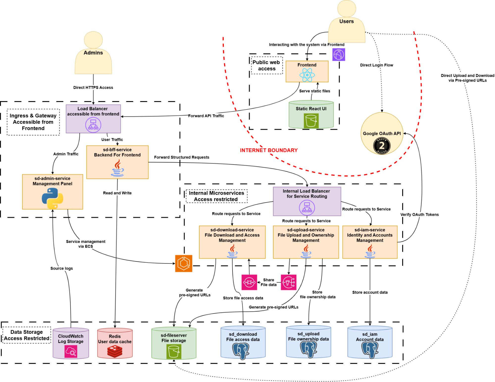

## Opis serwisów

### Frontend

Jest interfejsem użytkownika do komunikacji z aplikacją.

* Komunikuje się z BFF po HTTPS  
* Przekierowuje do Google oAuth do logowania

### BFF (Backend for frontend)

Jest interfejsem użytkownika do komunikacji z aplikacją.

* Jest pojedynczym punktem wejścia (API Gateway) pośredniczącym pomiędzy frontendem a siecią wewnętrzną.  
* Stanowi główną linię obrony aplikacji – weryfikuje tokeny JWT i dba o bezpieczną autoryzację zapytań.  
* Integruje komunikację z mikro serwisami zewnętrznymi (konta, upload, download oraz udostępnianie plików).  
* Optymalizuje działanie systemu, agregując odpowiedzi i wykorzystując pamięć podręczną (Redis).

### IAM Service

Odpowiada za logowanie przez Google OAuth, zarządzanie użytkownikami oraz generowanie tokenów JWT.

* Odbiera token Google OAuth, odczytuje zaszyte informacje: adres skrzynki pocztowej, imię i nazwisko oraz awatar. Tworzy nowego użytkownika w bazie IAM\_DB i ustawia jego status na aktywny  
* Generuje tokeny JWT, w których zaszywa:
  {  
    "access\_token": "\<inny\_token\>",  
    "scope": "<https://www.googleapis.com/auth/userinfo.email> <https://www.googleapis.com/auth/userinfo.profile> openid",  
    "expires\_in": 3544,  
    "token\_type": "Bearer",  
    "id\_token": "\<wlasciwy\_token\>”  
  }  
* **id\_token** jest wykorzystywany do komunikacji z *sd-upload-service* oraz *sd-download-service* przez *sd-bff-service*  
* Umożliwa usuwanie (wyłączania) kont użytkowników lub edytowanie indywidualnych danych

### Upload Service

Odpowiada za wrzucanie i usuwanie plików.

* Zwraca S3 Pre-signed URLs do Frontendu, na który jest przesyłany plik  
* Przechowuje metadane plików w Upload\_DB (lokalizacja pliku, właściciel, rozmiar)  
* Wysyła metadane plików na kolejkę SNS

### Download Service

Odpowiada za pobieranie plików i informacji o nich oraz za udostępnianie plików.

* Odbiera z SQS informacje o plikach i aktualizuje swoją bazę danych (mirror)  
* Trzyma w bazie informacje o udostępnieniach plików,
* Ściąga pliki z S3 (dostęp read-only)

### Admin Service

Pozwala na zarządzanie infrastrukturą oraz jej monitorowanie

* Zbiera logi ze wszystkich serwisów, liczy z nich statystyki  
* Zapewnia podgląd do baz danych \- IAM\_DB, Upload\_DB (read-only)  
* Wykonuje health check dla wszystkich serwisów  
* Łączy się z enginem do zarządzania serwisami

## Model danych

### IAM DB

#### Tabela: **accounts**

| Nazwa pola | Rodzaj danych | Opis |
| :---- | :---- | :---- |
| **id** | Identyfikator | Unikalny kod przypisany do konta. |
| **username** | Tekst | Nazwa użytkownika (login). |
| **first\_name** | Tekst | Imię użytkownika. |
| **last\_name** | Tekst | Nazwisko użytkownika. |
| **avatar\_url** | Link internetowy | Adres do zdjęcia profilowego. |
| **status** | Tekst | Stan konta: **ACTIVE** (aktywne), **DISABLED** (wyłączone), **LOCKED** (zablokowane). |
| **last\_login\_at** | Data i godzina | Kiedy użytkownik ostatnio się zalogował. |
| **created\_at** | Data i godzina | Kiedy konto zostało założone. |
| **updated\_at** | Data i godzina | Kiedy ostatnio zmieniono dane na tym koncie. |

#### Tabela: **identities**

| Nazwa pola | Rodzaj danych | Opis |
| :---- | :---- | :---- |
| **id** | Identyfikator | Unikalny kod tego połączenia. |
| **account\_id** | Identyfikator | Informacja, do którego konta z tabeli powyżej należy to logowanie. |
| **provider** | Tekst | Nazwa zewnętrznej firmy (w tym przypadku: GOOGLE). |
| **provider\_subject** | Tekst (Kod) | Numer identyfikacyjny użytkownika w systemie Google. |
| **email** | Adres e-mail | Adres e-mail pobrany z konta Google. |
| **email\_verified** | Tak / Nie | Informacja, czy e-mail został potwierdzony przez Google. |
| **created\_at** | Data i godzina | Kiedy użytkownik połączył to logowanie ze swoim kontem. |
| **updated\_at** | Data i godzina | Kiedy to połączenie było ostatnio aktualizowane. |

### Upload DB

### Tabela: **files**

| Nazwa pola | Rodzaj danych | Opis |
| :---- | :---- | :---- |
| **id** | Identyfikator | Unikalny kod przypisany do pliku. |
| **size** | Liczba | Rozmiar pliku (w bajtach). |
| **updated\_at** | Data i godzina | Kiedy plik był ostatnio modyfikowany. |
| **hash** | Tekst (Kod) | Techniczny znacznik wersji pliku (używany do sprawdzania, czy plik się zmienił). |
| **owner\_id** | Identyfikator | Identyfikator właściciela pliku. |
| **name** | Tekst | Oryginalna nazwa pliku (np. "dokument.pdf"). |
| **location** | Tekst | Ścieżka, na której fizycznie zapisany jest plik. |
| **content\_type** | Tekst | Format pliku (np. obrazek JPG, dokument tekstowy). |
| **status** | Tekst | Obecny stan pliku: **PENDING** (w trakcie przesyłania), **CONFIRMED** (gotowy). |

### Download DB

#### Tabela: **files**

| Nazwa pola | Rodzaj danych | Opis |
| :---- | :---- | :---- |
| **id** | Identyfikator | Unikalny kod przypisany do pliku. |
| **key** | Tekst | Wewnętrzny klucz/ścieżka pliku w systemie. |
| **size** | Liczba | Rozmiar pliku (w bajtach). |
| **last\_modified** | Data i godzina | Kiedy plik był ostatnio modyfikowany. |
| **e\_tag** | Tekst (Kod) | Techniczny znacznik wersji pliku (używany do sprawdzania, czy plik się zmienił). |
| **owner\_id** | Identyfikator | Identyfikator właściciela pliku. |
| **name** | Tekst | Oryginalna nazwa pliku (np. "dokument.pdf"). |
| **location** | Tekst | Ścieżka, na której fizycznie zapisany jest plik. |
| **content\_type** | Tekst | Format pliku (np. obrazek JPG, dokument tekstowy). |
| **status** | Tekst | Obecny stan pliku (np. w trakcie przesyłania, gotowy). |

#### Tabela: **file\_shares**

| Nazwa pola | Rodzaj danych | Opis |
| :---- | :---- | :---- |
| **id** | Identyfikator | Unikalny kod operacji udostępnienia. |
| **file\_id** | Identyfikator | Informacja, który plik jest udostępniany. |
| **from\_id** | Identyfikator | Użytkownik, który udostępnia plik (nadawca). |
| **to\_id** | Identyfikator | Użytkownik, któremu plik jest udostępniany (odbiorca). |

#### Tabela: **file\_downloads**

| Nazwa pola | Rodzaj danych | Opis |
| :---- | :---- | :---- |
| **id** | Identyfikator | Unikalny kod operacji pobierania. |
| **file\_id** | Identyfikator | Informacja, który plik jest pobierany. |
| **requested\_at** | Data i godzina | Kiedy użytkownik zażądał pobrania pliku. |
| **expires\_at** | Data i godzina | Data wygaśnięcia dostępu (do kiedy można pobrać plik). |

###

### S3

* Mechanizm opiera się na obiektach (ziarnach) zarządzanych bezpośrednio przez kontener Springa, w skład których wchodzi m.in. klient S3 oraz S3Presigner.  
* Parametry połączenia są dynamicznie wstrzykiwane i mapowane bezpośrednio z ustawień aplikacji oraz zmiennych środowiskowych.  
* S3Presigner odpowiada za generowanie bezpiecznych, tymczasowych linków (pre-signed URLs) pozwalających na autoryzowane pobieranie i wysyłanie plików.  
* Wygenerowany adres URL instruuje przeglądarkę, by wysłała plik bezpośrednio do AWS S3, co całkowicie odciąża backend z konieczności procesowania ciężkich transferów.  
* S3Presigner odgórnie koduje w przepustce dokładne miejsce zapisu pliku, wymuszając strukturę ownerId / fileId (wirtualny katalog użytkownika oraz identyfikator pliku).  
* Z góry narzucona i kryptograficznie podpisana ścieżka gwarantuje, że dane trafiają zawsze we właściwe miejsce, całkowicie eliminując ryzyko nadpisania lub dostępu do plików innych użytkowników.

### BFF Cache

* Mechanizm opiera się na bazie Redis w pamięci operacyjnej (in-memory), co gwarantuje błyskawiczny odczyt i zapis współdzielony między wieloma instancjami BFF.
* Aplikacja definiuje główny, nie lokując RedisCacheManager, który koordynuje dostępem do poszczególnych przestrzeni cache (bucketów).
* Wartości zapisywane w cache są konwertowane na format JSON przy użyciu Jackson2JsonRedisSerializer ze wsparciem dla modułu Java Time (dla dat i czasu). Klucze zapisywane są jako proste ciągi znaków (String).  
* Audience Cache: Dedykowana przestrzeń przechowująca proste typy liczbowe (Integer) z wydłużonym TTL (domyślnie 12 godzin).
* Account Details Cache: Specjalistyczna przestrzeń do przechowywania złożonych obiektów IAMAccountResponse z czasem wygaśnięcia wynoszącym 12 godzin.

## Przepływ danych w systemie

### Przesyłanie pliku

* użytkownik wybiera plik (opcjonalnie zmienia nazwę) i nadaje hasło do jego zaszyfrowania, Frontend szyfruje zawartość pliku i wyciąga metadane, które przesyła do BFF  
* BFF sprawdza tożsamość użytkownika i przesyła dane do Upload Service, który umieszcza metadane w Upload DB, ich kopię wysyła na kolejkę SNS oraz prosi S3 o Pre-signed-URL, który zwraca do BFF do Frontendu  
* Frontend przesyła zaszyfrowany plik na otrzymany URL i przesyła potwierdzenie do BFF \-\> Upload o poprawnym przesłaniu pliku  
* Download Service odbiera metadane z SQS i umieszcza je w swojej bazie (mirror danych)

### Pobieranie pliku

* Frontend prosi o hasło do pliku i występuje z żądaniem pobrania pliku  
* BFF sprawdza tożsamość użytkownika i prosi Download o pobranie pliku  
* Download sprawdza uprawnienia użytkownika i odsyła URL do pliku do BFF do Frontendu  
* Frontend pobiera i odszyfrowuje plik

### Udostępnianie pliku

* Frontend pobiera listę użytkowników według wpisanego maila i mapuje wskazany mail na user\_id, dla zadanego user\_id oraz file\_id przesyła żądanie o udostępnienie do BFF  
* BFF przekazuje prośbę do Download Service, który dodaje wpis do tabeli o udostępnieniach pliku

### Usuwanie pliku

* Frontend wysyła informacje o usunięciu pliku do BFF  
* BFF sprawdza tożsamość użytkownika i przesyła informacje do Upload Service, kasuje metadane pliku w Upload DB i przesyła stosowny komunikat na kolejkę SNS oraz usuwa plik z S3  
* Download Service odbiera metadane z SQS i usuwa metadane pliku ze swojej bazy (mirror) oraz tabeli o udostępnieniach pliku

## Zewnętrzne integracje

### Google OAuth

* Wykorzystujemy standardowy sposób łączenia się z serwisem Google OAath: [https://console.cloud.google.com](https://console.cloud.google.com)  
* Używamy wspólnego konta do administracji konsoli Google: “<skarabeusz.skalowalny@gmail.com>”  
* Skonfigurowaliśmy aplikację, a w niej klienta platformy do uwierzytelniania  
* GOOGLE\_CLIENT\_ID oraz GOOGLE\_SECRET są używane w infrastrukturze AWS do zestawiania połączenia z serwisem OAuth Google  
* W kodzie serwisów używamy standardowej paczki Java Spring “org.springframework.security.oauth2”

# Infrastruktura AWS

## Networking

Topologia sieciowa systemu ScaleDrop została zbudowana wewnątrz dedykowanej chmury **AWS VPC (Virtual Private Cloud)**. Zastosowano trójwarstwową architekturę w celu wymuszenia izolacji i bezpiecznego przepływu danych.

* **Warstwa brzegowa i dystrybucji:** Umiejscowiona poza główną granicą VPC. **Amazon CloudFront (Globalny CDN)** działa jako pojedynczy, publiczny punkt wejścia dla użytkowników. Serwuje on statyczne pliki frontendu bezpośrednio z bucketa **Amazon S3** oraz bezpiecznie przekazuje cały ruch zapytań do API w głąb sieci (proxy).  
* **Publiczna podsieć wejściowa:** Zawiera publiczny **Application Load Balancer (ALB1)**. Jest to jedyny komponent wystawiony do internetu. Otrzymuje zewnętrzne zapytania HTTPS i kieruje je do serwisu `sd-bff-service` wewnątrz podsieci aplikacyjnej. Obsługuje również bezpośredni dostęp dla administratorów korzystających z panelu zarządzania, z pominięciem warstwy CDN.  
* **Prywatna podsieć aplikacyjna:** Całkowicie odcięta od bezpośredniego dostępu do internetu. Hostuje klaster **Amazon ECS (Fargate)**. Wewnątrz tej podsieci wdrożono wewnętrzny **Application Load Balancer (ALB2)**. API Gateway (`sd-bff-service`) odbiera żądania z publicznego ALB1, przetwarza je i przekazuje za pośrednictwem wewnętrznego ALB2 do mikroserwisów (`sd-iam`, `sd-upload`, `sd-download`), dzięki czemu routing wewnętrzny jest całkowicie ukryty dla świata zewnętrznego.  
* **Prywatna podsieć bazodanowa:** Najgłębsza, najbardziej restrykcyjna warstwa, w której znajduje się instancja **Amazon RDS PostgreSQL**. Nie posiada ona żadnego routingu do internetu. Dostęp sieciowy jest zarządzany przez rygorystyczne reguły **VPC Security Groups**, które ściśle ograniczają ruch przychodzący wyłącznie do portu `5432` i dopuszczają go wyłącznie z poziomu prywatnej podsieci aplikacyjnej.

## Compute

Warstwa obliczeniowa korzysta z orkiestracji kontenerów z wykorzystaniem **Amazon ECS (Elastic Container Service) z technologią AWS Fargate**.

* **Silnik AWS Fargate:** Eliminuje narzut operacyjny i ryzyko bezpieczeństwa związane z zarządzaniem klasycznymi instancjami EC2 czy demonami Dockera. Każde zadanie (ECS Task) działa we własnym, odizolowanym środowisku micro-VM, co zapobiega atakom typu *container breakout*.  
* **sd-bff-service (Backend-For-Frontend):** Pełni funkcję głównego API Gateway. W celu bezpiecznego zarządzania sesjami użytkowników i bardzo szybkim buforowaniem, wykorzystuje kontener **Redis** wdrożony we wzorcu **Sidecar**. Współdzielą one tę samą przestrzeń sieciową, co pozwala na komunikację wyłącznie przez interfejs `localhost` (`127.0.0.1`), całkowicie izolując pamięć podręczną od ruchu w sieci VPC.  
* **sd-iam-service:** Zarządza tożsamością i kontami. Integruje się z zewnętrznym **Google OAuth API**, aby bezpiecznie weryfikować przychodzące tokeny tożsamości (ID tokens) podczas procesu logowania.  
* **sd-upload-service & sd-download-service:** Dedykowane, lekkie mikroserwisy obsługujące biznesową logikę przesyłu plików i autoryzacji dostępu.  
* **sd-admin-service:** Wewnętrzny panel zarządzania napisany w Pythonie (Streamlit). Wykorzystuje bibliotekę AWS SDK (**boto3**) do bezpośredniej interakcji z architekturą chmurową. Poza odpytywaniem schematów baz danych przez zastrzeżone połączenie, aplikacja pełni rolę aktywnego kontrolera klastra – potrafi zarządzać usługami ECS, wymuszając ich restart, włączanie, wyłączanie oraz ponowne wdrożenia (redeploy). Dodatkowo integruje się z usługą Amazon CloudWatch w celu agregacji i odczytu logów systemowych w czasie rzeczywistym.

## Storage

System ScaleDrop rozdziela zarządzanie stanem aplikacji od przechowywania surowych danych, używając w tym celu kombinacji relacyjnych baz danych oraz magazynu obiektowego, ściśle przestrzegając praktyk bezpieczeństwa architektury *cloud-native*.

* **Amazon S3 (Magazyn plików użytkowników):** Pliki przesłane przez użytkowników są przechowywane w dedykowanym buckecie (`sd-fileserver`), do którego dostęp publiczny jest całkowicie zablokowany. System odciąża kontenery ECS z konieczności procesowania ciężkich danych binarnych dzięki zastosowaniu **Pre-signed URLs**. Usługi `sd-upload` i `sd-download` walidują uprawnienia i generują krótkoterminowe, kryptograficznie podpisane linki URL. Aplikacja frontendowa (przeglądarka) odbiera/wysyła pliki bezpośrednio do S3 z wykorzystaniem tych wygenerowanych kluczy. Ponadto wdrożono **szyfrowanie po stronie klienta** – pliki są szyfrowane jeszcze przed opuszczeniem komputera użytkownika, co czyni je nieczytelnymi nawet dla administratorów chmury AWS.  
* **Amazon RDS PostgreSQL:** Zarządza danymi relacyjnymi. Zaimplementowano wzorzec **Database per Service** poprzez podział bazy na logicznie izolowane schematy bazodanowe: `sd_iam` (konta i logowania), `sd_upload` (metadane przesłanych plików) oraz `sd_download` (widok aktywnych plików gotowych do pobrania).

## IAM i permissions

Granice bezpieczeństwa w całym środowisku chmurowym są egzekwowane poprzez bezwzględne stosowanie Zasady Najmniejszych Przywilejów przy pomocy usługi AWS IAM.

* **Uprawnienia zadań (ECS Task Roles):** Każdy mikroserwis otrzymał unikalną rolę IAM. Przykładowo, jedynie `sd-upload-service` i `sd-download-service` posiadają jawne uprawnienia do interakcji z API usługi Amazon S3 w celu podpisywania linków URL, podczas gdy główny węzeł API (`sd-bff-service`) nie posiada żadnego dostępu ani do S3, ani do bazy relacyjnej RDS.  
* **Uprawnienia na poziomie bazy danych:** W warstwie danych serwisy dziedzinowe mają uprawnienia zapisu/odczytu wyłącznie do swoich schematów, natomiast panel `sd-admin-service` uwierzytelnia się przy pomocy odrębnego użytkownika bazy danych, mającego uprawnienia zawężone wyłącznie do odczytu. Mechanizm ten zapobiega wszelkim próbom destrukcyjnego SQL Injection.  
* **Uprawnienia CI/CD:** Zautomatyzowany potok GitHub Actions loguje się do platformy AWS z wykorzystaniem technicznego użytkownika IAM (Machine User), którego prawa są restrykcyjnie ograniczone do operacji wypychania obrazów Dockera do **Amazon ECR** oraz aktualizacji definicji zadań (Task Definitions) w ECS. Nie ma on możliwości modyfikowania ani kasowania infrastruktury sieciowej lub danych.

## Secrets Management

System wdraża politykę zerowego zaufania i całkowicie eliminuje luki w postaci twardego kodowania sekretów, haseł do baz danych czy kluczy do zewnętrznych API w kodzie źródłowym lub jawnych zmiennych środowiskowych.

* **AWS Systems Manager (SSM) Parameter Store:** Działa jako główny, szyfrowany sejf chmurowy dla konfiguracji.  
* **Zautomatyzowane generowanie przez IaC:** W fazie wdrażania infrastruktury (Infrastructure as Code), skrypt Terraform automatycznie losuje mocne, wysokiej entropii hasła. Wartości te są przekazywane i trwale zapisywane bezpośrednio w usłudze SSM jako szyfrowane ciągi `SecureString`.  
* **Wstrzykiwanie w czasie uruchamiania (Runtime Injection):** Demon AWS Fargate odpowiedzialny za start kontenerów kontaktuje się z usługą SSM, odszyfrowuje klucze w locie i wstrzykuje je natychmiast do pamięci RAM poszczególnych kontenerów jako zabezpieczone zmienne środowiskowe, minimalizując ryzyko ich wycieku.

## Koszty (Kompromisy projektowe)

Ze względu na edukacyjny format projektu, a także pulę darmowych kredytów z **AWS Free Tier / AWS Educate**, architektura celowo integruje elementy optymalizacji oraz formalną **Akceptację Ryzyka (Risk Acceptance)**. Rozwiązania, które normalnie są uznawane za rygorystyczne standardy Enterprise, zostały w tych obszarach uproszczone:

* **Pominięcie usługi AWS WAF:** Wdrożenie i utrzymanie zapory aplikacyjnej warstwy 7 (WAF) generuje znaczące opłaty stałe i opłaty za każde zrealizowane żądanie HTTP. System w obecnej fazie akceptuje ryzyko ataków na poziomie warstwy aplikacji, całkowicie delegując obronę zewnętrzną darmowym i wbudowanym w usługę Amazon CloudFront mechanizmom absorpcji ataków wolumetrycznych L3/L4 (AWS Shield Standard).  
* **Zarządzane, domyślne certyfikaty SSL/TLS:** Wykupienie niestandardowej nazwy domenowej oraz utrzymanie dedykowanej strefy publicznej w usłudze Amazon Route 53 wiąże się ze stałymi miesięcznymi opłatami. By uchronić projekt przed szybszym wyczerpaniem kredytów, system bazuje na domyślnych, wieloznacznych certyfikatach HTTPS, które AWS za darmo przypisuje do swoich usług dystrybucji (`*.cloudfront.net` lub domeny Load Balancerów). Zapewnia to identyczny, wymagany poziom bezpieczeństwa kryptograficznego w locie, kosztem rezygnacji z indywidualnego brandingu adresu URL.  
* **Ograniczenie do jednej Strefy Dostępności:** Utworzenie rozszerzonego, w pełni redundantnego systemu oznacza w chmurze dublowanie liczby uruchomionych instancji Compute/Storage w rezerwowych centrach danych oraz konieczność pokrywania kosztów ciągłej synchronizacji wewnątrz-sieciowej. Na obecnym etapie zrezygnowano z tej warstwy tolerancji na awarię.  
* **Wyłączenie retencji danych bazy i obiektów:** Ponieważ celem infrastruktury wykonanej w modelu Infrastructure-as-Code jest bycie "ulotną" i możliwą do zniszczenia/wskrzeszenia w każdym momencie, baza RDS w definicji wdrożeniowej otrzymała bezwzględną flagę pomijania płatnych kopii końcowych (`skip_final_snapshot = true`), co połączono z niewersjonowaniem plików w S3.

# Bezpieczeństwo

## Uwierzytelnianie

* Dostęp do aplikacji oraz jej możliwości wyłącznie przy zalogowaniu się przez aktywne konto Google  
* Używamy OAuth 2.0 oraz minimalnego zbioru uprawnień wymaganych do zestawienia połączenia z tym serwisem Googlowskim  
* Zaciągany OAuth token uwierzytelnia użytkownika i nadaje dostęp do aplikacji  
* Aplikacja jest dostępna publicznie tzn. nie wymagane jest połączenie przez prywatną sieć VPN

## Autoryzacja

* Google token z OAuth 2.0 jest przekierowany do serwisu sd-iam, aby umożliwić generowania własnych tokenów JWT  
* Używamy własnych tokenów JWT do komunikacji z serwisami *sd-upload* oraz *sd-download*  
* Użytkownik A ma dostęp tylko do swoich plików oraz do tych, które znajdują się w tabeli *file-shares* z *toId* użytkownika A

## Ochrona danych użytkowników

### Zakres danych pozyskiwanych z Google OAuth

* Adres mailowy  
* Imię i nazwisko  
* Zdjęcie profilowe (awatar)

### Mechanizm szyfrowania plików

Wykorzystuje standardowy i wbudowany interfejs **Web Crypto API**.

Kod używa algorytmu **PBKDF2** (Password-Based Key Derivation Function 2). Algorytm ten łączy hasło z losowym ciągiem znaków (solenie) i "miesza" je aż **100 000 razy** przy użyciu funkcji skrótu **SHA-256**. Taka duża liczba iteracji celowo spowalnia proces, co sprawia, że ataki typu *brute-force* stają się nieopłacalne czasowo. Wynikiem tego procesu jest silny, **256-bitowy** klucz **AES-GCM**.

Proces szyfrowania składa się z kilku etapów:

* **Generowanie losowości:** Tworzona jest unikalna dla każdego pliku, 16-bajtowa **sól** oraz 12-bajtowy **Wektor Inicjujący (IV)**. Nawet jeśli zaszyfruje się ten sam plik dwa razy tym samym hasłem, wynik (szyfrogram) będzie za każdym razem wyglądał zupełnie inaczej.  
* **Generowanie klucza:** Na podstawie hasła od użytkownika i wygenerowanej soli, funkcja deriveKey tworzy klucz szyfrujący.  
* **Właściwe szyfrowanie:** Plik jest szyfrowany algorytmem **AES-GCM**. Jest to nowoczesny standard (używany m.in. w bankowości), który nie tylko szyfruje dane, ale też zapewnia ich *autentyczność*. Oznacza to, że jeśli ktokolwiek spróbuje zmienić choćby jeden bajt w zaszyfrowanym pliku, proces deszyfrowania zwróci błąd, co chroni przed manipulacją danymi.  
* **Pakowanie:** Aby plik można było później odszyfrować, aplikacja musi pamiętać użytą sól oraz wektor IV (nie są one tajne, tajne jest tylko hasło). Skrypt "skleja" te informacje w jeden bufor:  
  * **Pierwsze 16 bajtów** to Sól.  
  * **Kolejne 12 bajtów** to wektor IV.  
  * **Cała reszta** to właściwe zaszyfrowane dane pliku.

Odszyfrowywanie działa w analogiczny sposób tylko kolejność operacji jest odwrócona oraz sprawdzany jest rozmiar pliku (czy plik ma co najmniej 28 bajtów \= 16 bajtów soli \+ 12 bajtów IV).

## Rate limiting

* Mechanizm opiera się na koncepcji Token Bucket, zaimplementowanej przy użyciu biblioteki Bucket4j  
* Użytkownicy są rozróżniani na podstawie kontekstu (z tokena JWT lub oznaczani jako anonimowi).  
* Limity są precyzyjnie rozliczane dla każdego użytkownika oraz każdego endpointu z osobna, dzięki generowaniu unikalnych kluczy.  
* Aspekt w Springu przechwytuje żądania przed kontrolerem i decyduje o ich przepuszczeniu na podstawie dostępności żetonów w wirtualnym "wiaderku".  
* Brak żetonów skutkuje natychmiastowym przerwaniem operacji i zwróceniem wyjątku, bez obciążania dalszych warstw aplikacji.  
* Wiaderka utrzymywane są w pamięci RAM, a żetony uzupełniane są w sposób płynny.  
* Limity są zarządzane za pomocą dedykowanej adnotacji na poziomie metod kontrolera.

# Modelowanie zagrożeń (Threat Modeling)

W niniejszym rozdziale przeprowadzono analizę bezpieczeństwa systemu ScaleDrop, identyfikując potencjalne ataki oraz zaimplementowane mechanizmy mitygacji (ochrony). Analiza opiera się na docelowej architekturze wdrożeniowej w chmurze AWS, wykorzystującej konteneryzację (ECS Fargate), separację sieciową (VPC) oraz usługi zarządzane.

## Identyfikacja zasobów krytycznych (Assets)

Do najważniejszych zasobów systemu, które wymagają najwyższego poziomu ochrony, należą:

* **Dane użytkowników (PII)** – przechowywane w bazie relacyjnej PostgreSQL (schemat `sd_iam`).  
* **Pliki użytkowników** – zlokalizowane w dedykowanym buckecie Amazon S3.  
* **Sekrety i poświadczenia infrastrukturalne** – hasła do bazy danych, klucze API, hasło administratora.  
* **Dostępność usług (Uptime)** – kluczowa dla działania aplikacji i panelu administracyjnego.

## Analiza wektorów ataków i mitygacje

### Zagrożenie: Ataki wolumetryczne i wyczerpanie zasobów (DDoS / DoS)

* **Wektor ataku:** Zalanie publicznych punktów końcowych (API lub frontendu) fałszywym ruchem w celu zablokowania dostępu prawdziwym użytkownikom.  
* **Mitygacja w systemie:**  
  * **Warstwa brzegowa:** Aplikacja kliencka serwowana jest z Amazon S3 za pośrednictwem Amazon CloudFront (CDN), który natywnie absorbuje ataki DDoS w warstwie 3 i 4 (sieciowej i transportowej).  
  * **Elastyczne skalowanie:** Użycie AWS Application Auto Scaling dla usług ECS zapewnia, że w przypadku nagłego wzrostu obciążenia, system automatycznie powoła nowe kontenery (skalowanie horyzontalne), zapobiegając padom pojedynczych instancji.

### Zagrożenie: Nieautoryzowany dostęp i eskalacja uprawnień (Spoofing / Elevation of Privilege)

* **Wektor ataku:** Przejęcie konta użytkownika, podszycie się pod administratora lub bezpośrednia próba wywołania wewnętrznych mikroserwisów z pominięciem API Gateway.  
* **Mitygacja w systemie:**  
  * **Federacja Tożsamości (OAuth):** System nie przechowuje haseł użytkowników (co eliminuje ataki typu *credential stuffing*). Logowanie odbywa się przez zewnętrznego dostawcę (Google OAuth). Za weryfikację i bezpieczeństwo tokenów OAuth odpowiada wyłącznie dedykowany `sd-iam-service`.  
  * **Ukrycie topologii wewnętrznej:** Mikroserwisy dziedzinowe (`sd-iam`, `sd-upload`, `sd-download`) znajdują się w prywatnej podsieci (Private Subnet) bez dostępu z Internetu. Ruch kierowany jest wyłącznie przez wewnętrzny Load Balancer (Internal ALB), do którego dostęp ma tylko warstwa wejściowa (dostęp z `sd-bff-service`).  
  * **Ochrona sesji (Wzorzec Sidecar):** Baza Redis obsługująca stan i sesje dla BFF została wdrożona jako kontener typu *Sidecar*. Komunikacja odbywa się wyłącznie wewnątrz pojedynczego zadania ECS przez interfejs `localhost`, całkowicie odcinając bazę od ruchu w sieci VPC.  
  * **Zasada Najmniejszych Przywilejów (Least Privilege):** Potok CI/CD (GitHub Actions) operuje na dedykowanej roli IAM z uprawnieniami ograniczonymi wyłącznie do aktualizacji specyfikacji ECS. Z kolei Panel Administracyjny łączy się z bazą RDS przy użyciu unikalnego użytkownika z prawami wyłącznie do odczytu (*Read-Only*), co całkowicie eliminuje ryzyko destrukcyjnych ataków SQL Injection.

### Zagrożenie: Wyciek plików i danych z bazy (Information Disclosure)

* **Wektor ataku:** Odczytanie prywatnych plików z S3, przechwycenie danych z bazy RDS przez niepowołane podmioty lub błąd konfiguracji uprawnień w AWS.  
* **Mitygacja w systemie:**  
  * **Szyfrowanie po stronie klienta (Client-Side Encryption):** System realizuje podejście zbliżone do *End-to-End Encryption*. Pliki są szyfrowane po stronie przeglądarki klienta jeszcze **przed** ich wysłaniem do chmury. Przechowywane w S3 obiekty są kryptograficznie nieczytelne dla infrastruktury AWS oraz administratorów systemu.  
  * **Izolacja sieciowa bazy (Network Isolation):** Instancja RDS znajduje się w odseparowanej, prywatnej podsieci. Dostęp do niej posiadają wyłącznie wybrane kontenery aplikacyjne poprzez rygorystyczne reguły Security Groups.  
  * **Ochrona dostępu do plików (Pre-signed URLs):** Buckety S3 posiadają aktywną blokadę `Block Public Access`. Mikroserwisy ECS po zweryfikowaniu uprawnień w bazie generują tymczasowe, kryptograficznie podpisane linki (Pre-signed URLs) ważne tylko przez krótki okres, co uniemożliwia bezpośrednie lub stałe linkowanie do plików (hotlinkowanie).

### Zagrożenie: Przechwycenie ruchu i manipulacja konfiguracją (Tampering)

* **Wektor ataku:** Podsłuchanie ruchu (Man-in-the-Middle), modyfikacja przesyłanych danych lub kradzież sekretów konfiguracyjnych z repozytorium kodu.  
* **Mitygacja w systemie:**  
  * **Szyfrowanie w locie (In-Transit):** Komunikacja pomiędzy użytkownikiem a punktami wejścia do infrastruktury (CloudFront, Load Balancer) wymusza użycie protokołu HTTPS, korzystając z domyślnych certyfikatów wystawionych przez AWS.  
  * **Zarządzanie sekretami (Secrets Management):** Żadne hasła (np. do bazy danych, dla administratora) ani klucze nie są wpisywane w kod źródłowy ani jawne zmienne Terraform. Są one losowo generowane podczas budowania infrastruktury, zapisywane jako obiekty `SecureString` w AWS SSM Parameter Store, a usługa ECS wstrzykuje je do pamięci RAM kontenerów dopiero w momencie startu aplikacji.

## Znane ograniczenia i akceptacja ryzyka (Risk Acceptance)

Biorąc pod uwagę konieczność optymalizacji kosztów pod budżet ograniczony pakietami AWS Free Tier / AWS Educate, architektura posiada świadomie zaakceptowane kompromisy. W przypadku wdrożenia w pełni produkcyjnego wymagałyby one rozbudowy:

1. **Brak zaawansowanej zapory aplikacyjnej (AWS WAF):** AWS WAF nie wchodzi w skład standardowego darmowego pakietu, a jego utrzymanie generuje stałe koszty (opłaty za samą definicję WebACL, zestaw reguł oraz każdy milion przetworzonych żądań). Ze względu na bardzo ograniczoną pulę kredytów chmurowych, wdrożenie WAF skutkowałoby zbyt szybkim wyczerpaniem budżetu projektu. Akceptujemy ryzyko ataków aplikacyjnych w warstwie 7 (np. HTTP floods, botnety), opierając bezpieczeństwo na darmowej, wbudowanej ochronie warstwy 3/4 w usłudze CloudFront.  
2. **Brak dedykowanych certyfikatów SSL/TLS na niestandardowych domenach:** Pozyskanie własnej domeny, zarządzanie strefami DNS (np. Amazon Route 53\) w celu wystawienia i podpięcia certyfikatów z AWS Certificate Manager wiąże się z wysokimi opłatami, na które nie możemy sobie pozwolić ze względu na ograniczone kredyty. Aby uniknąć generowania zbędnych kosztów, system wykorzystuje darmowe certyfikaty wildcard domyślnie dostarczane przez AWS dla zarządzanych usług (takich jak `*.cloudfront.net` czy domeny Load Balancerów). Zapewnia to pełne, wymagane bezpieczeństwo kryptograficzne całego ruchu sieciowego, kosztem rezygnacji z warstwy wizerunkowej (własnego brandingu w pasku przeglądarki)  
3. **Uproszczona polityka kopii zapasowych (Brak Disaster Recovery):** Ze względu na koszty przechowywania danych w AWS (Storage Costs), zrezygnowano z rozbudowanych mechanizmów ciągłego backupu. Baza danych RDS posiada wyłączoną funkcję tworzenia końcowych migawek przed usunięciem, a buckety S3 nie mają włączonego wersjonowania obiektów (Object Versioning). Akceptujemy ryzyko całkowitej i nieodwracalnej utraty danych w przypadku celowego, złośliwego ataku typu Ransomware (usunięcie/nadpisanie danych) lub katastrofalnego błędu ludzkiego (tzw. "Fat-finger error" przez administratora). W środowisku produkcyjnym wymagałoby to wdrożenia AWS Backup oraz reguł zapobiegających przypadkowemu usunięciu (np. S3 Object Lock).

# Development i DevOps

## Struktura repo

Założono organizację na GitHub, która zawiera repozytorium dla każdego z serwisów oraz do dodatkowych komponentów na potrzebę lokalnego developmentu (baza danych, symulacje usług AWS) oraz do konfiguracji Terraform.  
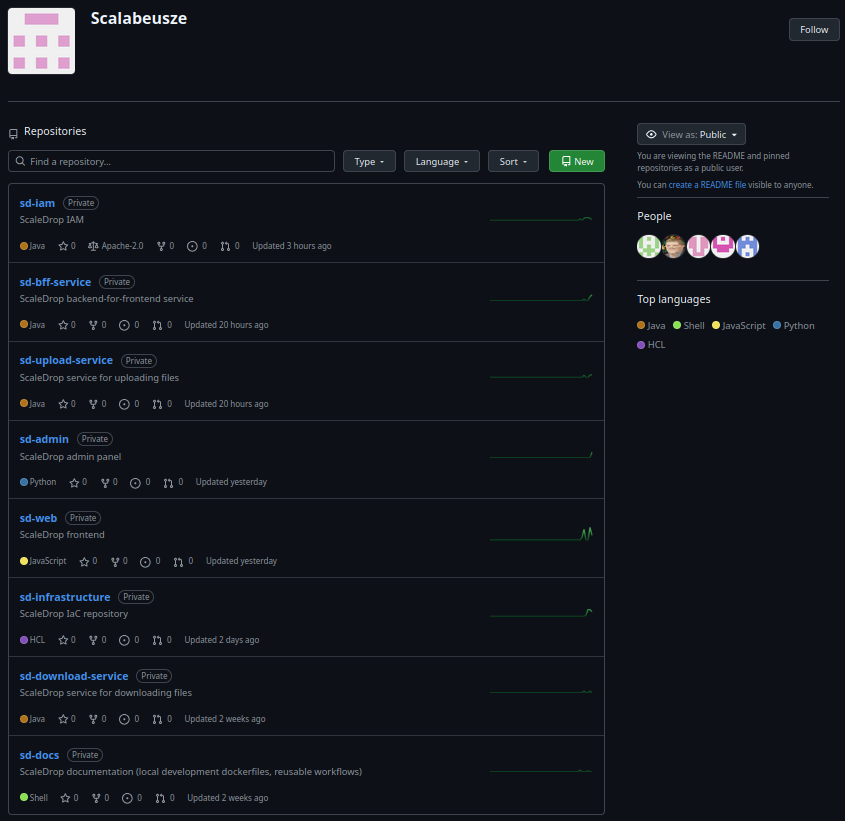

## Development

Lokalne środowisko developmentu opiera się na dwóch trybach uruchamiania aplikacji oraz osobnym repozytorium wspierającym infrastrukturę AWS.

Serwisy mogą być uruchamiane bezpośrednio przez Gradle, co zapewnia szybki development i debugowanie na lokalnej maszynie, lub w pełnym środowisku kontenerowym, które odzwierciedla środowisko produkcyjne i pozwala testować integracje między usługami.

Dodatkowo wykorzystywane jest osobne repozytorium **sd-docs**, które dostarcza lokalne środowisko symulujące usługi AWS oraz zależności systemowe.

W jego skład wchodzą:

* PostgreSQL – baza danych aplikacji  
* Redis – cache i mechanizmy pomocnicze  
* LocalStack – emulacja usług AWS (S3, SNS, SQS)  
* setup-resources – automatyczna inicjalizacja zasobów (bucket S3, kolejki, topic SNS)

Dzięki temu możliwe jest uruchomienie pełnego środowiska lokalnego bez potrzeby korzystania z realnych usług AWS, przy zachowaniu kompatybilności z produkcyjną architekturą systemu.

## Terraform

System wykorzystuje podejście Infrastructure as Code (IaC) oparte o Terraform, dzięki czemu cała infrastruktura AWS jest definiowana w sposób deklaratywny i wersjonowany w repozytorium Git. AWS pełni wyłącznie rolę warstwy wykonawczej, a źródłem prawdy jest kod infrastruktury.

W repozytorium **sd-infrastructure** znajdują się osobne pliki odpowiadające poszczególnym komponentom systemu, takim jak sieć (VPC), klastry ECS, load balancery, baza danych, storage S3 oraz mechanizmy komunikacji asynchronicznej (SNS/SQS). Dodatkowo każdy mikroserwis posiada własne definicje infrastruktury obejmujące m.in. ECS oraz ALB, co pozwala na ich niezależne zarządzanie i skalowanie.

Zmiany w infrastrukturze są wdrażane poprzez pipeline CI/CD w GitHub Actions, który automatycznie wykonuje plan zmian (terraform plan), a następnie – po ręcznej akceptacji – stosuje je w AWS (terraform apply). Takie podejście zapewnia powtarzalność środowisk, pełną kontrolę nad zmianami oraz eliminację ręcznych modyfikacji w konsoli AWS.

## CI/CD \- GitHub Actions

Do automatycznego deploy’u nowej wersji usługi zostało skonfigurowane GitHub Actions. Przy wrzucaniu kodu na gałąź *main* kod jest budowany i testowany, następnie ładowane są odpowiednie sekrety AWS, budowany jest obraz kontenera i publikowany do Amazon ECR.

Po opublikowaniu obrazu pipeline pobiera aktualną definicję zadania ECS, podmienia w niej wersję obrazu na nowo zbudowaną (oznaczoną unikalnym identyfikatorem commita), a następnie wdraża nową wersję usługi do klastra Amazon ECS. Proces deploy’u odbywa się w trybie rolling update, co zapewnia brak przestojów aplikacji.

Dodatkowo pipeline oczekuje na osiągnięcie stabilności usługi w ECS, co pozwala automatycznie zweryfikować poprawność wdrożenia nowej wersji przed zakończeniem procesu CI/CD.

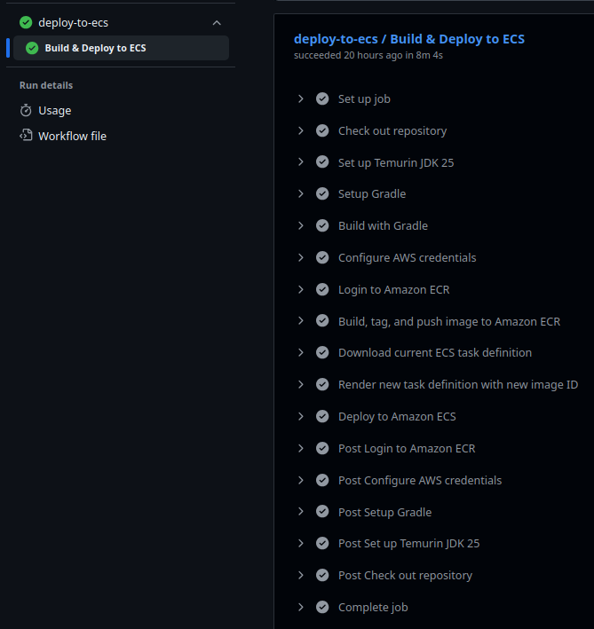

## Dokumentacja API

Dokumentacja API serwisów BFF, IAM, Upload, Download została wykonana narzędziem Swagger.

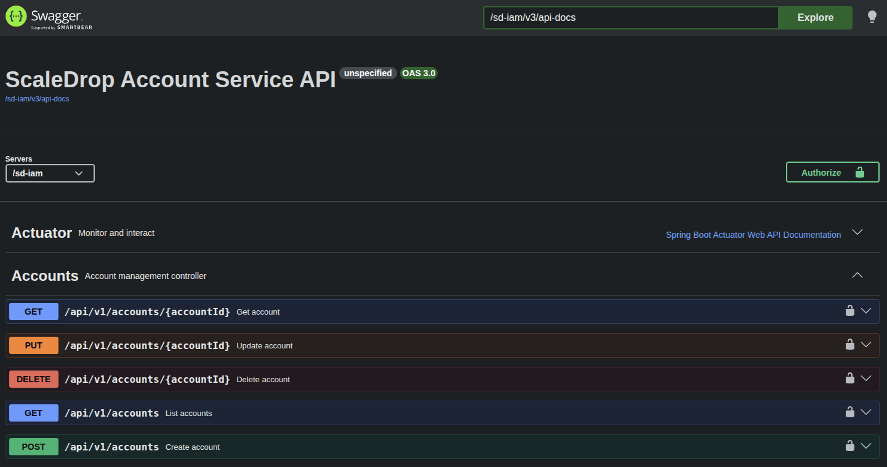

# Administracja systemu (Admin Service)

Do panelu admina należy najpierw zalogować się podając login i hasło.  
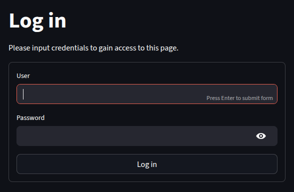
Po lewej stronie mamy opcję wyboru wybranej zakładki \- serwisy, logi i monitoring, bazy danych oraz możliwość wylogowania się.

## Zarządzanie usługami & Health check

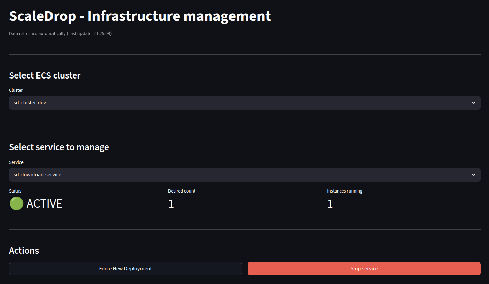
W tym miejscu możemy sprawdzić stan oraz liczbę instancji każdego z serwisów, a także zatrzymać, uruchomić lub wykonać świeży Deploy wybranego serwisu.

## Logowanie & Monitoring

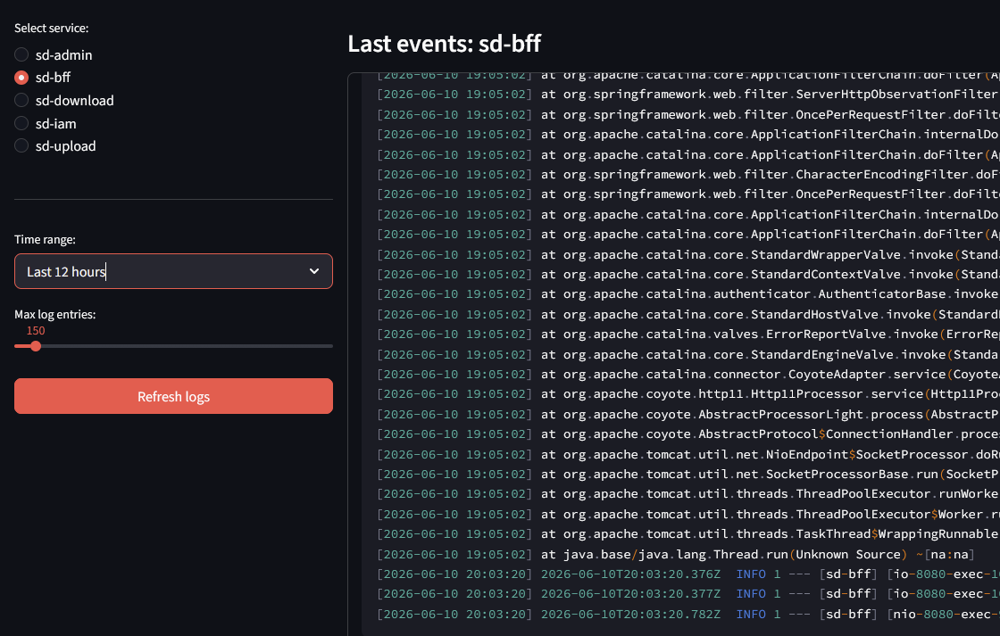
Wybieramy interesujący nas serwis oraz maksymalną liczbę logów z ostatniego zadanego okresu czasu. Admin pobiera stosowne logi z Amazon CloudWatch.

## Bazy danych

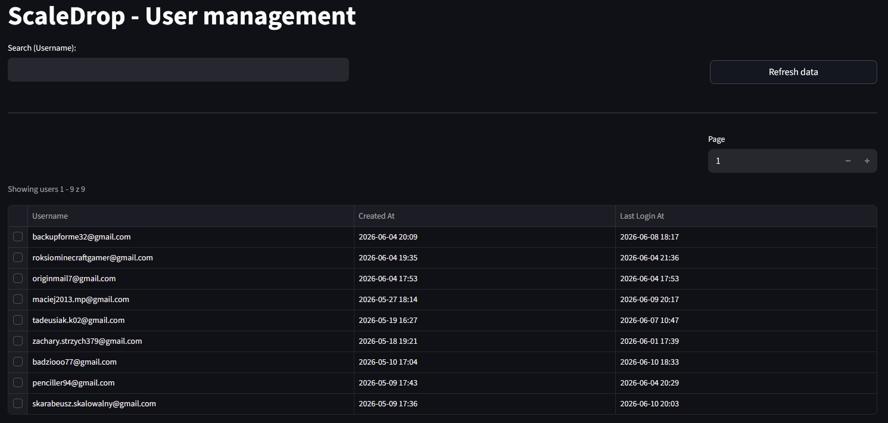
W zakładce “Database” widzimy tabelę użytkowników wraz z mailem, datą rejestracji konta oraz datą ostatniej aktywności w systemie.

Po wejściu w wybranego użytkownika widać wszystkie informacje na temat konta oraz listę jego wszystkich plików.  
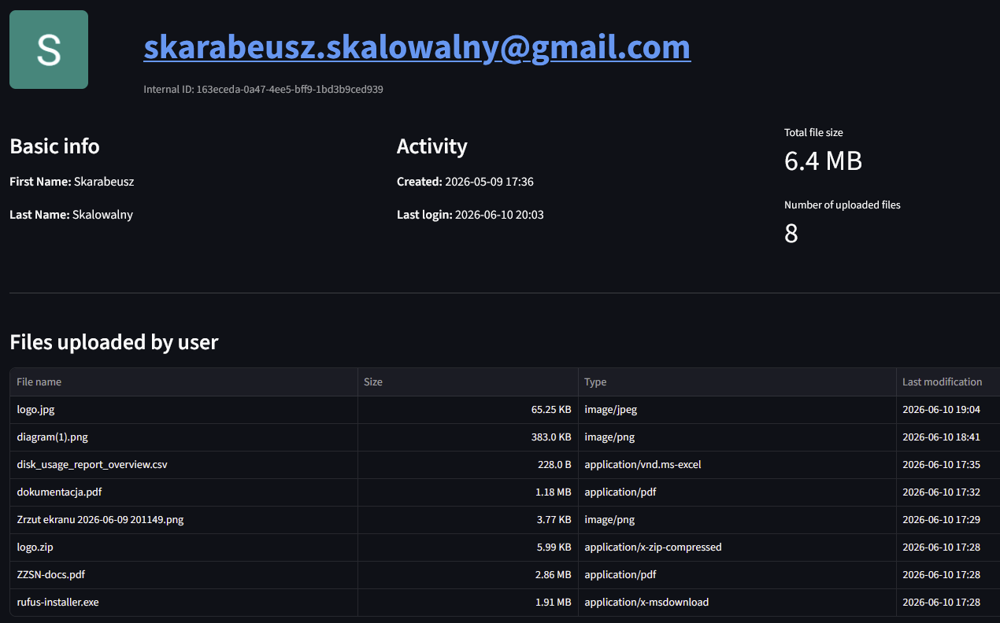

# Skalowalność systemu

Architektura Scale Drop została zaprojektowana w modelu mikro serwisowym, co pozwala na niezależne skalowanie poszczególnych komponentów systemu w zależności od obciążenia.

Frontend oraz BFF mogą być skalowane poziomo za pomocą load balancera, co zapewnia obsługę rosnącej liczby użytkowników bez wpływu na pozostałe warstwy systemu.

Kluczowe serwisy (IAM, Upload, Download) działają jako niezależne usługi w ECS, dzięki czemu mogą być skalowane oddzielnie w zależności od liczby operacji takich jak logowanie, upload czy pobieranie plików.

Warstwa storage oparta o Amazon S3 zapewnia praktycznie nieograniczoną skalowalność bez potrzeby ręcznej konfiguracji. Metadane przechowywane w bazach danych mogą być skalowane poprzez replikację i niezależne skalowanie instancji.

Komunikacja asynchroniczna oparta o SNS/SQS pozwala na buforowanie ruchu i odciążenie serwisów, co dodatkowo zwiększa odporność systemu na skoki obciążenia.

Całość infrastruktury uruchamiana w ECS wspiera autoskalowanie, co umożliwia dynamiczne dostosowanie liczby instancji do aktualnego ruchu bez przestojów.

# Wydajność

Zebrane zostały metryki (rozmiar pliku, czas wysyłki/pobrania) serwisów dla odpowiednio **sd-upload** oraz **sd-download** pośrednicząc przez sd-bff. Celem testów jest pokazanie, że wąskim gardłem w aplikacji jest łącze internetowe użytkownika, a nie problemy wydajnościowe aplikacji webowej, czy serwisów. Komputer testowy posiada łącze 70 MB/s (down) / 30 MB/s (up) mierzone w megabajtach na sekundę.

Przygotowany wykres przedstawia czas przesyłu w skali logarytmicznej, aby czytelniej zobrazować różnice w wartościach między plikami.

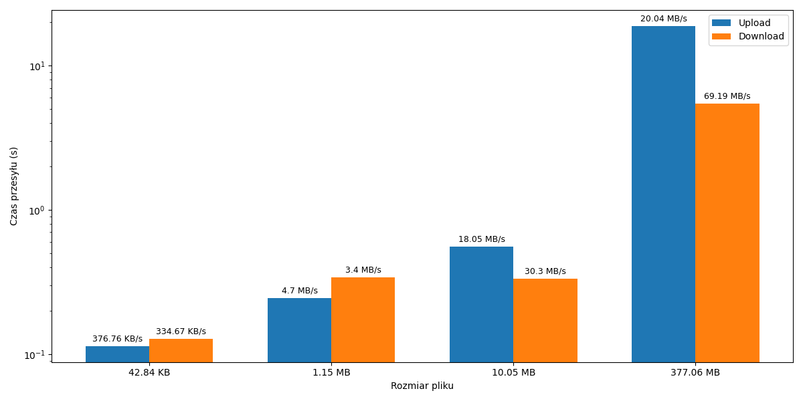
Wysłanie \- 114ms, 245ms, 557ms, 18.82s  
Pobranie \- 128ms, 339ms, 332ms, 5.45s

Widoczne jest, że im większy jest rozmiar pliku, tym dłuższy jest czas wysyłki/pobrania. Typowy czas wykonania zapytania do serwisów to ok. 200\~300ms, także nawet dla chudych plików jest on na tyle mały, że użytkownik nie czeka nadmiernie długo, aż wyśle/pobierze plik.

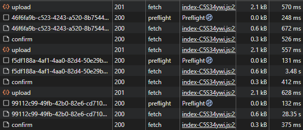
